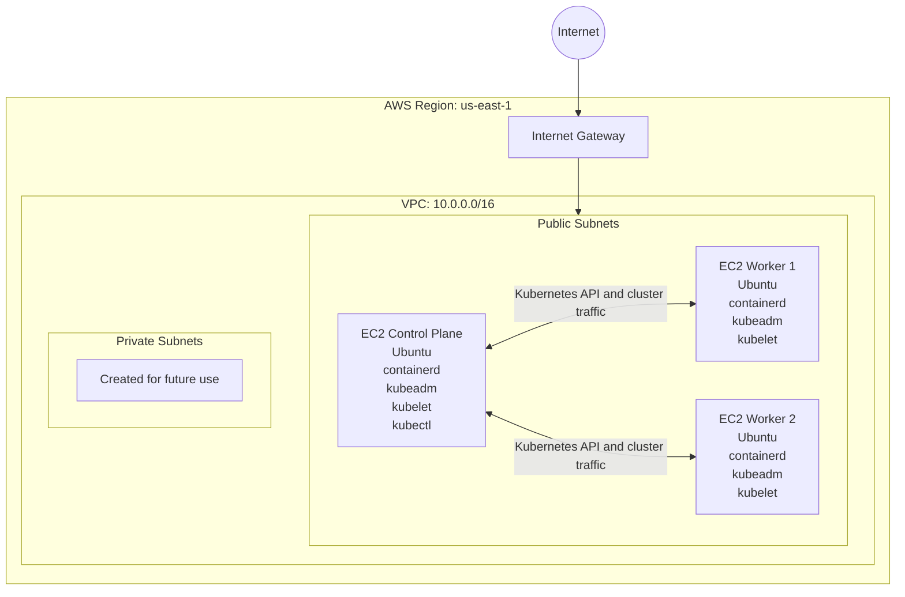

# Kubernetes Cluster on AWS with Terraform

This project builds a self-managed Kubernetes lab cluster on Amazon Web Services using Terraform, EC2, cloud-init, containerd, and kubeadm.

The deployment creates:

- One Kubernetes control plane node
- Two Kubernetes worker nodes
- A custom AWS VPC
- Three public subnets
- Three private subnets
- An internet gateway and public route table
- A security group for SSH, Kubernetes API access, and internal cluster communication
- Automated Kubernetes installation and control plane initialization
- Automated worker-node joining

> This project is intended for education and lab use. It is not designed as a production-ready Kubernetes platform. Use at your own risk!

## Architecture



All three EC2 instances are currently deployed into the first public subnet and receive public IP addresses. The private subnets are created but are not currently used by the cluster nodes.

## Deployment Workflow

```text
./build.sh
    |
    +-- terraform init
    |
    +-- terraform plan -out plan.out
             |
             v
./run.sh
    |
    +-- terraform apply plan.out
    |
    +-- cloud-init configures the control plane and workers
    |
    +-- kubeadm initializes the control plane
    |
    +-- Terraform downloads the kubeadm join command
    |
    +-- Terraform uploads and runs the join command on each worker
    |
    +-- Deployment duration and connection details are displayed
```

## Technologies

- Terraform
- Amazon Web Services
- Amazon EC2
- Ubuntu
- cloud-init
- containerd
- Kubernetes
- kubeadm
- kubelet
- kubectl
- Bash
- Calico networking

## Repository Structure

```text
k8-lab/
├── .gitignore
├── .terraform.lock.hcl
├── README.md
├── build.sh
├── control-plane-user-data.sh.tftpl
├── destroy.sh
├── main.tf
├── outputs.tf
├── providers.tf
├── run.sh
├── variables.tf
├── versions.tf
└── worker-user-data.sh.tftpl
```

| File | Purpose |
|---|---|
| `main.tf` | Creates the AWS network, security group, EC2 instances, and worker join workflow |
| `variables.tf` | Defines AWS, networking, EC2, SSH, and Kubernetes settings |
| `outputs.tf` | Displays control plane and worker IP addresses and SSH commands |
| `providers.tf` | Configures the AWS provider |
| `versions.tf` | Defines Terraform and provider version requirements |
| `control-plane-user-data.sh.tftpl` | Bootstraps the Kubernetes control plane through cloud-init |
| `worker-user-data.sh.tftpl` | Bootstraps each Kubernetes worker through cloud-init |
| `build.sh` | Initializes Terraform and creates `plan.out` |
| `run.sh` | Applies `plan.out`, records elapsed time, and displays connection details |
| `destroy.sh` | Destroys the Terraform-managed AWS resources |

## Default Configuration

| Setting | Default |
|---|---|
| AWS region | `us-east-1` |
| Environment | `LAB` |
| VPC CIDR | `10.0.0.0/16` |
| Public subnets | `10.0.1.0/24`, `10.0.2.0/24`, `10.0.3.0/24` |
| Private subnets | `10.0.10.0/24`, `10.0.11.0/24`, `10.0.12.0/24` |
| Availability Zones | `us-east-1a`, `us-east-1b`, `us-east-1c` |
| Control plane instance | `t3.medium` |
| Worker instance | `t3.medium` |
| Worker count | `2` |
| Kubernetes version | `1.36` |
| Pod CIDR | `192.168.0.0/16` |
| SSH username | `ubuntu` |

The Ubuntu AMI ID is currently set in `variables.tf`. AMI IDs are region-specific and can become outdated, so verify that it is valid in your selected AWS region before deploying.

## Prerequisites

Install and configure:

- Terraform
- AWS CLI
- Git
- Bash
- OpenSSH client with `ssh` and `scp`
- An AWS EC2 key pair
- A matching local private key file

Git Bash is recommended when running this project from Windows because Terraform invokes Bash and `scp` during the worker join workflow.

Verify the required tools:

```bash
terraform version
aws --version
bash --version
ssh -V
scp
```

Configure AWS authentication with an AWS CLI profile or environment variables:

```bash
aws configure
```

Confirm access:

```bash
aws sts get-caller-identity
```

Do not commit AWS credentials or private SSH keys to the repository.

## Configuration

Create a `terraform.tfvars` file in the repository root.

```hcl
ssh_key      = "Demo-key-01"
ssh_key_path = "C:/github/k8-lab/Demo-key-01.pem"
```

Use an AWS CLI profile or environment variables rather than storing credentials in `terraform.tfvars`.

```bash
export AWS_PROFILE="default"
```

Ensure local variable files and private keys are ignored:

```gitignore
*.tfvars
*.pem
join.sh
plan.out
.terraform/
*.tfstate
*.tfstate.*
```

## Deploy the Cluster

Make the scripts executable:

```bash
chmod +x build.sh run.sh destroy.sh
```

Create the Terraform plan:

```bash
./build.sh
```

Apply the saved plan:

```bash
./run.sh
```

The script displays normal Terraform output and then reports deployment status, elapsed apply time, the control plane public IP, and the SSH command.

## Verify the Cluster

Connect to the control plane using the command printed by `run.sh`, or retrieve it directly:

```bash
terraform output -raw control_plane_ssh_command
```

After connecting:

```bash
kubectl get nodes -o wide
kubectl get pods -A
kubectl cluster-info
```

Expected node layout:

```text
NAME                STATUS   ROLES           AGE
k8-control-plane    Ready    control-plane
k8-worker-1         Ready    <none>
k8-worker-2         Ready    <none>
```

Available Terraform outputs:

- `control_plane_public_ip`
- `control_plane_ssh_command`
- `worker_public_ips`
- `worker_ssh_commands`

## How cloud-init Is Used

Terraform renders and submits these templates as EC2 user data:

```text
control-plane-user-data.sh.tftpl
worker-user-data.sh.tftpl
```

Ubuntu processes them with cloud-init on first boot. The control plane initializes Kubernetes and creates the worker join command. Worker nodes install the required components and wait for Terraform to transfer and execute that join command.

## Troubleshooting

### Check cloud-init

```bash
sudo cloud-init status --long
sudo tail -200 /var/log/cloud-init-output.log
sudo less /var/log/cloud-init.log
sudo cat /var/lib/cloud/instance/user-data.txt
```

### Check Kubernetes

```bash
kubectl get nodes -o wide
kubectl get pods -A
kubectl cluster-info
sudo systemctl status kubelet
sudo systemctl status containerd
```

### Terraform waits for initialization

Terraform waits for these readiness files:

```text
/var/tmp/k8-control-plane-ready
/var/tmp/k8-worker-ready
```

If Terraform continues waiting, inspect cloud-init logs on the affected instance.

### SCP or SSH fails on Windows

```bash
which bash
which ssh
which scp
```

Use a forward-slash path for the private key:

```hcl
ssh_key_path = "C:/github/k8-lab/Demo-key-01.pem"
```

## Destroy the Lab

```bash
./destroy.sh
```

The script runs:

```bash
terraform destroy -auto-approve
```

Review your AWS account afterward to confirm that all billable resources have been removed.

## Security Notes

The current lab security group allows SSH on port `22` and Kubernetes API access on port `6443` from `0.0.0.0/0`. These rules simplify lab access but are not appropriate for production. Restrict them to your public IP or trusted network.

The nodes also run in a public subnet. A more secure design would use private subnets and controlled access through a bastion host, VPN, AWS Systems Manager, or a similar method.

## Known Lab Limitations

- Single control plane node
- No high availability
- Worker count fixed at two
- All nodes use the first public subnet
- Private subnets are created but unused
- No NAT gateway
- No ingress controller
- No persistent storage configuration
- No remote Terraform state backend
- Broad inbound security group rules
- Provisioners and local SCP are used for cluster joining
- Intended for temporary learning environments

## Possible Enhancements

- Make worker count configurable
- Distribute nodes across Availability Zones
- Move nodes into private subnets
- Restrict SSH and Kubernetes API CIDR ranges
- Replace the static AMI ID with an AWS Systems Manager parameter lookup
- Add a remote Terraform state backend
- Add bounded readiness checks
- Retrieve kubeconfig securely for local `kubectl`
- Add ingress, storage, monitoring, and CI/CD validation

## License

This repository is intended for educational and lab use.
